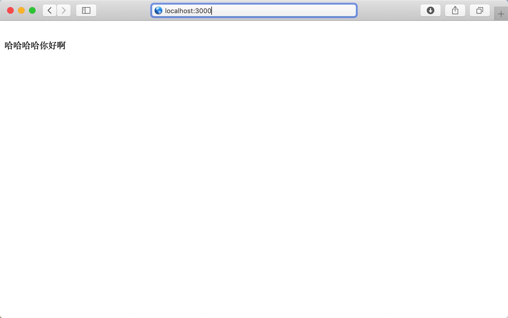

# 安装
登录nodejs官网 [https://nodejs.org/zh-cn/](https://nodejs.org/zh-cn/)，下载nodejs安装文件。

> //TODO nodejs 也可以通过nvm(node version manager)安装

安装完成 ， 查看版本
```bash
node -v
```

# 开始编写
- 新建文件夹 NodeServer
- 进入文件夹新建文件 server.js

```javascript
var express = require('express'); 
var app = express(); 

app.route('/').get(function(req,res){
  res.send("哈哈哈哈你好啊");
})

app.listen(3000, function () { 
console.log('Listening on port, process.cwd(): ' + process.cwd() ); 
}); 

```

# 运行
> 因为server服务引用了[Express](https://expressjs.com/zh-cn/)框架 ,所以此处要安装express的依赖

安装方法,使用nodejs自带的包版本管理 npm 指令
> npm install express

安装完成后，用node运行当前文件
> node server.js

访问路径
> http://localhost:30000


